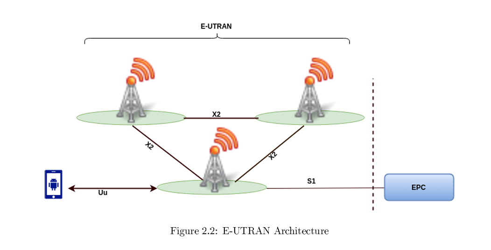

# introduction:

# The first generation (1G) :

The initial cellular phone networks were characterized as analog,  representing the first generation of mobile communication technology. The earliest wireless terminals, known as analog radiotelephones, were typically installed in vehicles or transported in briefcases. These devices were notably large, energy-intensive, and offered limited coverage. The first generation, referred to as 1G, provided a subpar and prohibitively expensive mobile communication service. Numerous deficiencies were associated with 1G, including the lack of compatibility standards across different regions and the vulnerability of analog transmissions, which allowed for the interception of calls. The inaugural generation of cellular telephony was commercially launched under the designation of AMPS (Advanced Mobile Phone Service) and employed frequency division multiplexing (FDMA) to facilitate voice channels within the 800 MHz frequency band. This initial generation of cellular networks, reliant on analog technology, was soon supplanted by a more advanced second generation that utilized digital technology.[^1]

# The second generation (2G):

The GSM network is a standard of mobile telephony known as "second generation." (2G), unlike the first generation, communications operate in an fully digital mode. The GSM standard allows a rate of 9.6Kbits/s, which enables the transmission of voice and thus only low-volume digital data.2G enabled the development and the launch of the SMS (Short Message Service) accessible to GSM subscribers.It is about a text message transmission service with a content limit of 160 characters. Among the advantages of the second generation, we can mention: better sound quality, portable devices and a certain level of communication privacy.The advancements of the second generation allowed the general public access to mobile telephony [^1]

# 1-Architecture of a GSM network :

The GSM network is divided into three main subsystems:

- BSS (Base Station Sub-system)

- NSS (Network Sub-system)

- OSS (Operation Support Sub-system)
  
  **The figure 1.1** presented below depicts the overall structure of the GSM network, encompassing the three subsystems along with the various interconnections among them and the internal connections within the distinct components of each subsystem.
  
  

**Figure 1.1**: GSM Architecture

### 1-1-Mobile Station :

In the Global System for Mobile Communications (GSM), the mobile station comprises two distinct components: the mobile equipment, commonly referred to as the handset, and a smart card known as the Subscriber Identity Module (SIM). The SIM facilitates personal mobility, enabling users to access their subscribed services regardless of the specific terminal being utilized. By inserting the SIM card into an alternative GSM terminal, users can make and receive calls as well as access other subscribed services from that device. The mobile equipment is uniquely identified by the International Mobile Equipment Identity (IMEI), while the SIM card contains the International Mobile Subscriber Identity (IMSI), which serves to identify the subscriber within the system, along with a secret key for authentication and additional information. The independence of the IMEI and IMSI supports the concept of personal mobility. Furthermore, the SIM card may be secured against unauthorized access through the use of a password or personal identification number.[^2]

## 1-2-Base station subsystem:

The Base Station Subsystem is composed of two parts the Base Transceiver Station BTS and the Base Station Controller BSC These communicate across the standardized Abis interface allowing as in the rest of the systemoperation between components made by different suppliers.The BSS consist of base station controllers (BSC) and the 
base transceiver stations (BTS).[^3]

### 1-2-1Base Transceiver Station BTS:

The Base Transceiver Station (BTS) contains the radio transmitters that define a cellular area and manages the radio link protocols with the Mobile Station. In extensive urban environments, it is likely that numerous BTS units will be installed; therefore, the essential criteria for a BTS include durability, dependability, portability, and cost-effectiveness.

### 1-2-2 Base Station Controller BSC :

The Base Station Controller (BSC) is responsible for the management of one or multiple base stations, facilitating communication with these stations through the A-bis interface. This controller undertakes a variety of tasks pertinent to communication and operational functions. The BSC serves as a central hub for the communication processes of signals originating from the base stations, consolidating communications from various base stations into a singular output. Conversely, it also relays data to the designated base station. Additionally, the BSC maintains the database associated with the base stations and functions as a conduit for various alarm signals directed towards the operations and maintenance center. Another critical role of the BSC is the management of radio resources within the coverage area of the interconnected base stations. This capability enables the controller to oversee intercellular user transfers within its designated coverage area, facilitating the seamless transition of mobile communication as users move from one cell to another.[gsm5]

## 1-3 Network Switching Subsystem (NSS):

The NSS main role is to manage the communications between GSM and other network users. Another task of it includes the main switching functions of GSM, databases required for the subscribers, and mobility management.The NSS consists of:

### 1-3-1 Mobile Station Controller (MSC):

The interface A connects the mobile switching center to the radio subsystem. Its main role is to ensure switching between the subscribers of the mobile network and those of the public switched network (RTC), or its digital equivalent, the ISDN network. It provides various services to subscribers, such as telephony, value-added services, and messaging services. It is also possible to update the various databases (HLR and VLR) that contain all the data concerning subscribers and their location within the network. The MSC switches of an operator are connected to each other for internal information switching. To ensure interoperability between operators' networks, MSCs serving as gateways (Gateway Mobile Switching Center, GMSC) are placed on the periphery of an operator's network.[gsm5]

### 1-3-2 The authentication center (AUC):

The Authentication Center (AUC) is responsible for supplying authentication and encryption parameters that validate the identity of users and guarantee the confidentiality of each communication. The AUC serves as a safeguard for network operators against various forms of fraud prevalent in the contemporary cellular landscape. The Global System for Mobile Communications (GSM) employs standardized algorithms for encryption and authentication, which are utilized to dynamically generate challenge keys and encryption keys for each call.[^4]

### 1-3-3 The equipment identity register (EIR):

The equipment identity register (EIR) is a database that contains information about the identity of mobile equipment that prevents calls from stolen, unauthorized, or defective mobile stations. The AUC and EIR can be implemented as stand-alone nodes or as a combined AUC/EIR node.[^4]

### 1-3-4 Home Location Register(HLR):

This database encompasses all regulatory information pertaining to each supporter, along with their most recent known location. Consequently, the GSM system is capable of directing calls to the appropriate base station for the mobile station (MS). When a user activates their phone, the device registers with the network, allowing for the identification of the base transceiver station (BTS) it is communicating with, thereby facilitating the proper routing of incoming calls. Furthermore, even when the phone is not in active use (though powered on), it periodically re-registers to ensure that the network's Home Location Register (HLR) is updated with its latest position. There exists one HLR for each network, although it may be distributed across various sub-centers for operational efficiency.[^5]

### 1-3-5 Visitor Location Register(VLR):

The VLR is a database that contains the temporary abonné information that the
MSC needs to keep track of the abonnés while they are visiting. The MSC and
the VLR are always connected. When a mobile station moves to a new MSC
zone, the VLR connected to that MSC will ask the HLR for information on the
station. The VLR will provide the information required to set up the call without
having to ask the HLR each time if the mobile station sends out an appeal later.

### 1-3-6 Gateway Mobile Switching Center (GMSC):

The Gateway Mobile Switching Center (GMSC) serves as the initial point for directing a call to a Mobile Equipment (ME) without prior knowledge of the Mobile Station's (MS) location. Consequently, the GMSC is tasked with obtaining the Mobile Station Roaming Number (MSRN) from the Home Location Register (HLR) based on the Mobile Station ISDN Number (MSISDN), which functions as the "index number" for the MS. It is important to note that the inclusion of "MSC" in the term GMSC can be misleading, as the call routing process does not necessitate a connection to a Mobile Switching Center (MSC).[article03] 

### 1-3-7 SMS Gateway (SMS-G):

The term SMS-G, or SMS door, is employed to comprehensively refer to the two Short Message Service Gateways as defined within the GSM standards. These two gateways manage messages directed in distinct directions. The SMS-GMSC (Short Message Service Gateway Mobile Switching Center) is responsible for the transmission of short messages to a Mobile Equipment (ME). Conversely, the SMS-IWMSC (Short Message Service InterWorking Mobile Switching Center) is utilized for short messages initiated from a mobile device within that network. The functionality of the SMS-GMSC is analogous to that of the GMSC, whereas the SMS-IWMSC provides a fixed access point to the Short Message Service Center.[article03] 

## 1-4 Operation Support Subsystem (OSS):

The Operations and Maintenance Center (OMC) is integrated with all equipment within the switching system as well as with the Base Station Controller (BSC). The establishment of the OMC is referred to as the Operation Support System (OSS). This center serves as a centralized location for maintenance personnel to oversee and manage the entire system effectively.[article01]

# 2 GPRS (General Packet Radio Service) 2.5G:

As the demand for data transmission over the air interface has escalated, new components such as the Serving GPRS Support Node (SGSN) and the Gateway GPRS Support Node (GGSN) have been integrated into the existing Global System for Mobile Communications (GSM) framework. These components facilitate the transmission of packet data across the air interface. The segment of the network responsible for managing packet data is referred to as the 'packet core network.' In addition to the SGSN and GGSN, this network segment encompasses IP routers, firewall servers, and domain name servers (DNS). This configuration allows for wireless Internet access, achieving data rates of up to 150 kbps under optimal conditions.[^6]

# 3 EDGE (Enhanced Data Rates for GSM Evolution) 2.75G:

The EDGE standard represents an advancement in mobile telephony, evolving from the GSM framework. This technology incorporates a novel modulation technique that facilitates increased data transmission rates while utilizing the pre-existing GSM radio spectrum allocated to operators. Despite its comparatively lower speeds relative to subsequent UMTS (Universal Mobile Telecommunications System) technologies, EDGE is capable of delivering nearly all 3G services. Consequently, it presents a viable option for operators aiming to provide 3G services by leveraging the already available spectral resources of 2G.[^6]

# 4 The third generation (3G):

In EDGE, the capability for high-volume data transmission was achievable; however, the packet transfer over the air interface functioned similarly to a circuit-switched call. Consequently, a portion of the efficiency associated with packet connections was compromised within the circuit-switched framework. Additionally, the standards for network development varied across different regions of the world. Therefore, the decision was made to establish a network that offers services irrespective of the technological platform, with uniform network design standards applicable globally.[^6]

## Universale Mobile Telecommunications Syste UMTS:

UMTS is classified as a third generation (3G) wireless communication system, serving as an advancement over the second generation (2G) communication technologies and representing an evolution of GSM, GPRS, and EDGE (Poole, 2006). While the GSM network primarily facilitated voice communication for subscribers, there arose a necessity to accommodate the growing subscriber base alongside the demand for high-speed data services. In response to this need, the Third Generation Partnership Programme (3GPP) was established to manage the development and implementation of a system capable of supporting these enhanced services shown in **Figure 1.2** [9.[^7]

**figure 1.2** UMTS architecture 

## Universal Terrestrial Radio Access Network (UTRAN):

The UTRAN is the part of the UMTS network that is of highest concern in this thesis
work, therefore it will be described in details.

The system is divided into two sections:
a) The mobile terminal is used for radio communications via the Uu interface.
b) The USIM card is a chip that stores the subscriber's identity, the keys necessary for authentication and encryption, as well as various subscription information essential for the terminal. Additionally, it executes authentication algorithms.[gsm3]

### 4-1 User Uquipement (UE):

## Node-B :

The NodeB serves a function analogous to that of the Base Transceiver Station (BTS) within a GSM network. It is capable of managing multiple cells simultaneously. This component incorporates a CDMA receiver, which is responsible for transforming signals from the Uu interface, also known as the Air interface, into data streams that are directed to the Radio Network Controller (RNC) via the Iub interface. Conversely, the CDMA transmitter takes the data streams received from the RNC and converts them for transmission through the air interface.[^17]

## Radio Access Network (RAN):

The primary components with in this segment of the network consist of the base station (BS) and the radio network controller (RNC). Key responsibilities encompass the administration of radio resources as well as the management of telecommunications.[^6]

## Radio Network Controller (RNC) :

The Radio Network Controller (RNC) plays a crucial role in the management and allocation of resources within the Universal Terrestrial Radio Access Network (UTRAN). It interfaces with both the Iub and Iu connections. Additionally, multiple RNCs can be interconnected through an inter-Radio Network System (RNS) link known as the Iur interface.[TEKNIIKAN JA LIIKENTEEN TOIMIALA]

## Core Network (CN):

The core network plays an essential role in switching data to other external networks. More specifically, it is responsible for routing and switching to networks such as public fixed-line telephony or the Internet. This network also includes security management . In the core network, packet and circuit domains are clearly distinct, although the database, which contains subscriber information (phone numbers, authorized services, etc.), is a common element for both domains.Some of the elements in the circuit switched domain include:[^8]

The CN is similar to the network and switching subsystem (NSS) of the GSM 
architecture. The main function of the CN is to perform packet routing, connection of users, security, billing and the connection of UMTS to external packet switched and circuit switched networks (Neruda and Bestak, 2008). The CN elements can be categorised into a packet and circuit switched domain depending on the type of traffic and functions they handle. Some of the elements in the circuit switched domain include:[^9]

## 5- LONG TERM EVOLUTION (LTE):

Long Term Evolution (LTE) represents a fourth generation wireless communication standard that was developed by the 3rd Generation Partnership Project (3GPP) (Setiawan and Ochi, 2009). Although the initial publication of the standard occurred in 2005 with in the framework of release 6 (Mustaqim et al., 2012), its development continued until it was fully articulated in the release 8 documentation of 2008. While LTE is commonly referred to as 4G, it is important to note that LTE-Advanced, as defined in release 10, is recognized as the authentic 4G network, with release 8 being classified as 3.9G. The implementation of LTE was primarily motivated by the necessity to address the escalating demand for data rates associated with services such as gaming, streaming, and web browsing, which have seen a transition from megabits per second (Mbit/s) to gigabits per second (Gbit/s). Additionally, another significant impetus for the adoption of LTE was the aim to minimize delays and latency in network services while simultaneously enhancing the spectral efficiency of the network.[^9]

Long Term Evolution, commonly referred to by the acronym LTE, represents a significant advancement in mobile telephony standards. Among the major features of this network, the adoption of the OFDMA coding technique for downlink transmission and SC-FDMA for uplink transmission is noted. This approach allows each cell to benefit from a spectral bandwidth ranging from 3 to 20 MHz, resulting in increased bandwidth and, consequently, improved transmission speeds.

The LTE network architecture is characterized by its simplicity, consisting essentially of two components: a radio component, referred to as eUTRAN, and a core network, known as the EPC (Evolved Packet Core) [^8]

[^8]: POUR, D. D. U. A. M. MEMOIRE DE FIN D’ETUDES en vue de l’obtention du DIPLOME de Master.

The UMTS network architecture is depicted in the **figure 1.3**  below:

**figure 1.3** LTE architecture

## 5-1 User equipment (EU):

The internal architecture of LTE user equipment is identical to that used by UMTS and GSM, which is actually a mobile device (ME) that handles all communication functions. It is also known as the SIM card.[^11]

### 5-2 E-UTRAN:

The Evolved Universal Terrestrial Radio Access Network (E-UTRAN) serves as the access network within the Evolved Packet System (EPS), facilitating the transmission of data between User Equipment (UE) and the Evolved Packet Core (EPC). The E-UTRAN is comprised solely of a single component known as the Evolved NodeB (eNB), which interfaces with the EPC via the S1 physical interface. This S1 interface is further categorized into two segments: the S1-C interface, which manages the signaling procedures between the eNB and the Mobility Management Entity (MME), and the S1-U interface, which establishes the connection between the eNB and the Serving Gateway (SGW). Additionally, the eNB can connect to adjacent eNBs through the X2 interface, facilitating handover operations,see ***figure 1.5*** [^10]

 

## 5-2-1 eNodeB:

eNodeB is the equivalent of BTS in the GSM network and NodeB in the UMTS network. The transfer functionality is more efficient in LTE. These are antennas that use RF air interfaces to connect the UEs to the core network of the LTE. In addition, eNodeB has the capability of radio controller, which means that the result is more efficient and the network is less latent. For example, eNodeB determines mobility 
instead of BSC or RNC.[gsm5]

## 5-3 Evolved Packet Core(EPC):

The core network referred to as "EPC" employs "full IP" technologies, which are grounded in Internet protocols for signaling, thereby facilitating reduced latency, as well as the transport of voice and data. This core network enables interconnection through routers with various remote eNodeBs, networks of different mobile operators, fixed telephony systems, and the Internet.

EPC streamlines the network architecture to a purely IP-based framework, ensuring seamless mobility across both 3GPP radio access technologies and non-3GPP alternatives, such as WIMAX and CDMA2000.

## 5-3-1 Home Subscriber Server (HSS):

The hosts database encompasses the user subscription information pertinent to the EPS. It facilitates user authentication and access authorization, while also maintaining the identity of the MME to which a user is affiliated or registered. Furthermore, the HSS contains data regarding the PDNs to which the user is permitted to connect. This system is founded on the principles of the Home Location Register (HLR) and the Authentication Centre (AuC).[Master_Thesis_Jose_Gamboa]

## 5-3-2 Mobility Management Entity (MME):

The MME serves as the control node responsible for overseeing signaling interactions between the User Equipment (UE) and the core network. It plays a crucial role in managing the connections between a UE and a logical node within the core network, encompassing the phases of establishment, reconfiguration, and termination of these connections. A significant aspect of its function is to oversee the signaling and security connections between the network and the UE.[^12]

## 5-3-3 Serving Gateway (SGW) :

All IP packets directed to a user are routed via the Serving Gateway (SGW). In instances where the SGW obtains data intended for a standby End User (EU), it communicates with the Mobility Management Entity (MME) to inform the EU, thereby re-establishing the connections linked to the respective contexts. Additionally, the SGW undertakes various supplementary tasks within the visited network during roaming scenarios, including the transmission of billing data, such as the amount of data transmitted and received by the user.[^12]

## 5-3-4 P-GW (Packet GetWay):

Facilitates data connectivity to external packet data networks, including the Internet and the IP Multimedia Subsystem (IMS). IMS networks are employed to deliver multimedia services, encompassing voice over Internet protocol (VoIP), video conferencing, and messaging.[gsm3]

## 5-3-5 Policy and Charging Rules Functin (PCRF):

The PCRF is an optional element within the EPC architecture. However, it plays a crucial role by enabling the application of advanced management rules concerning traffic and user billing, based on their plan. To implement these rules, the PCRF interacts with the PCEF (Policy Control Enforcement Function), which is integrated into the PDN-GW. Additionally, the PCRF has the ability to specify, during the establishment of a session or during its execution, the quality of service characteristics that the PCEF must apply.[^12]

[^12]: Antonio, S. R. L. DIMENSIONNEMENT ET OPTIMISATION DE LA COUVERTURE RADIO DU RESEAU 4G LTE.

## The interfaces:[4G lte]

The interfaces mentioned below are based on the Diameter protocol.

**The S6a interface*** establishes a connection between the MME and the HSS, facilitating the transfer of authentication and location data. This allows determining whether a user can access the LTE network.

**The S11 interface*** ensures the link between the MME and the SGW, limited to signaling exchange.

**The S10 interface*** connects two MMEs, allowing MME reinstallation as well as information transfer from one MME to another.

***The S3 interface*** connects the SGSN to the MME, enabling the exchange of information related to the user and the bearer, facilitating mobility within the 3GPP access network, whether in inactive or active state.

**The S1-MME interface** connects the eNode B to the MME, dedicated exclusively to signaling.

**The S5 interface** connects the PGW to the SGW, transporting user data as well as some signaling messages.

The S4 interface establishes a connection between the SGSN and the PGW, providing appropriate control.

The related interface serves as a mobility support between the GPRS core and the 3GPP anchoring function of the PGW.

The S1-U interface establishes a connection between the eNode B and the SGW, dedicated exclusively to the transport of user data, without signaling exchanges.

**The S1-MME interface*** connects the eNode B to the MME, limited to the transport of signaling messages.

**The X2 interface** interconnects two eNode B, allowing the transport of both user data and signaling messages.

**The Uu interface** or radio interface, ensures transmission over the radio channel and is located between the terminal (UE) and the eNode B, transporting both user data and signaling messages.

**The Gx interface** connects the PGW to the PCRF, allowing the PGW to access the charging rules provided by the PCRF, which enables it to and bill the user based on service flows rather than volume.

**The Rx interface** connects the PCRF to IP networks, ensuring quality of service.
Management service with the PCRF entity.

***The SGi interface*** establishes the connection between the PGW and the external IP network (Internet).

.

.

.

.

[3] M.A. Rakotomalala, « Evolution des réseaux mobiles », Cours M2-STI-TCO-ESPA, Année Universitaire 2016-2017.

[2]:BOUGUEN, Yannick, HARDOUIN, Eric, et WOLFF, François-Xavier. LTE pour les
reseaux 4G. Editions Eyrolles, 2012.

6] Jean-Marie Dilhac « Une introduction aux télécommunications », Presses Universitaires du Mirail, 04/10/2012.
[7] JOACHIM Tisal, “Le réseau GSM: l’évolution GPRS, une étape vers l’UMTS”, edition 3,
1999

[17]POUR, DEVELOPPEMENT D’UNE APPLICATION MOBILE.
"MEMOIRE DE FIN D’ETUDES en vue de l’obtention du DIPLOME de
Master."

[10]Scourias, John. "Overview of the global system for mobile
communications." University of Waterloo 4 (1995).

[18]M. Rumney, « LTE and the Evolution to 4G Wireless », Agilent Technology, 2009 
[19]E. Dahlman, S. Parkvall, J. Sköld, P. Beming, « 3G Evolution HSPA and LTE for Mobile 
Broadband », Second Edition Academic Press, 2008 
[20]E. Dahlman, S. Parkvall, J. Sköld, « 4G LTE / LTE – Advanced for Mobile Broadband », 
Academic Press, 2011

[^1]: Ouerdia, Aous, and Mesbahi Cylia. *Etude, planification et configuration d’une liaison à faisceau hertzien entre deux sites GSM*. Diss. Université Mouloud Mammeri, 2016.

[^2]: Bakare, B. I., Ekanem, I. A., & Allen, I. O. (2017). Appraisal of global system for mobile communication (GSM) in Nigeria. *American Journal of Engineering Research*, *6*(6), 97-102.

[^12]: Antonio, S. R. L. DIMENSIONNEMENT ET OPTIMISATION DE LA COUVERTURE RADIO DU RESEAU 4G LTE.

[^11]: Ouerdia, A., & Cylia, M. (2016). *Etude, planification et configuration d’une liaison à faisceau hertzien entre deux sites GSM* (Doctoral dissertation, Université Mouloud Mammeri).

[^10]: Gamboa Sánchez, J. U. (2017). *LTE self-backhauling: implementation and evaluation* (Master's thesis, Universitat Politècnica de Catalunya).

[^9]: Bakare, B. I., Ekanem, I. A., & Allen, I. O. (2017). Appraisal of global system for mobile communication (GSM) in Nigeria. *American Journal of Engineering Research*, *6*(6), 97-102.

[^8]: POUR, D. D. U. A. M. MEMOIRE DE FIN D’ETUDES en vue de l’obtention du DIPLOME de Master.

[^7]: Irving, P., & Ochang, P. A. (2016). Evolutionary analysis of GSM, UMTS and LTE mobile network architectures. *World Scientific News*, *54*, 27-39.

[^6]: Mishra, A. R. (2004). *Fundamentals of cellular network planning and optimisation: 2G/2.5 G/3G... evolution to 4G*. John Wiley & Sons.

[^5]Albarakati, A. J. An Overview of 4G (4th Generation) Wireless Networks.

[^4]Kabir, M. (2009). Cellular Mobile Systems and Services, TCOM1010. *Day-01_Intro. pdf*.

[^3]: Scourias, J. (1995). Overview of the global system for mobile communications. *University of Waterloo*, *4*.
