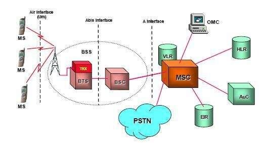

## introduction:

## The first generation (1G) :

## The second generation (2G):

## 1-Architecture of a GSM network :

The GSM network is divided into three main subsystems which are Base Station Sub-system *(BSS)*, Network Sub-system *(NSS)* and Operation Support Sub-system *(OSS)*. The overall structure of the GSM network, encompassing the three subsystems along with the various interconnections among them and the internal connections within the distinct components of each subsystem, is presented in **Figure 1.1**.

`https://media.geeksforgeeks.org/wp-content/uploads/network-GSM.jpg`

### Mobile station:

The mobile network's user portion consists of everything the subscriber needs to access GSM. It consists of two main components:

**mobile equipment (ME):** is the device itself that sends and receives wireless signals and also controls the communication process and converts sound into digital signals .
**SIM—Subscriber Identity Module—** is used to identify the subscriber on the network through IMSI.

## Base station subsystem *(BSS)*

The Base Station Subsystem provides the radio access and handles communication between the mobile phone *(Mobile Station or MS)* and the rest of the network. The **BSS** composed of two parts, the Base Transceiver Station *(BTS)* and the Base Station Controller *(BSC)*, that communicates across the standardized **A-bis** interface.

**Figure**: 2G GSM architecture [^ Analysis of 2G and 4G Network Quality in Solok City]

### Base Station Transceiver *(BTS)*

The **BTS** is responsible for radio transmission, that sends and receive radio signals to/from mobile devices *(error correction coding, modulation, equalization)*. In addition, it manages the physical layer *(multiplexing and encryption)*. It also manages the data link layer for signaling exchange between mobiles and the infrastructure. Each **BTS** covers a specific geographical area, hundreds of meters in cities and several kilometers in rural areas.

### Base Station Controller *(BSC)*:

The **BSC** is the intelligent part of **BSS**, It manages a group of **BTS's** via an **A-bis** interface. It controls channel allocation, uses measurements made by the **BTS** to control the transmission powers of mobiles and/or the **BTS** and decides whether to perform a handover. It is also a switch that carries out a concentration of circuits towards the **MSC** via an **A-interface**.

## Network Switching Subsystem (NSS):

 The **NSS** main role is to manage the communications between **GSM** and other network users. Another task of it includes the main switching functions of **GSM**, databases required for the subscribers, and mobility management.

It is a fixed network that includes all the functions necessary for establishing calls and mobility. It includes switches, gateways to the PSTN (Public Switched Telephone Network) as well as databases.

### The Mobile service Switching Centre (MSC)

This mobile service switch manages the establishment of communications between a mobile and another **MSC** as well as the transmission of short messages *(SMS)* and the execution of handover when it is involved. It communicates with the **VLR** to manage the mobility of users *(verification of the characteristics of visiting subscribers during an outgoing call, transfer of location information, etc.)*. It can have a **GMSC** gateway function *(MSC Gateway)* which is activated at the start of each call from a fixed subscriber to a mobile subscriber.

### Home location register

The **HLR** is a database that manages subscribers of a **PLMN** *(Public Land Mobile Network)*. It stores the subscriber's international identity used by the network *(IMSI)*, the subscriber's directory number *(MSISDN)*, and the subscription profile. The **HLR** also has location data and stores the **VLR** number where each subscriber is registered. A subscriber is therefore associated with a unique **HLR**, regardless of their location, and is then identified by their **MISDN**.

### Visitor Location Register (VLR):

The **VLR** is a database that stores the subscription data of subscribers present in a geographical area. The data stored by the **VLR** is similar to that of the **HLR** but only concerns mobile subscribers present in the area in question. It also assigns the temporary identity *(TMSI)* to the mobile when it enters the covered area.

 

`Home Location Register:It is a main database that contains information about permanent subscribers to the GSM network. The HLR contains the details of each SIM card in the network and uses the card's IMSI as the primary key to search its records, which the MSC uses to find out the location, number, etc. Victor Location Registration (VLR): It is a temporary database for tracking MSC participants, to temporarily store information without the need for an HLR and when you leave it is automatically deleted to ensure the conversation flows.`

### The Equipment Identities Register (EIR):

is a database containing IMEI (International Portable Equipment Identity Number) device identities. It contains a list of mobile phone devices that are monitored, stolen or blocked from the network. Mobile phones are identified by an IMEI (International Mobile Equipment Identity) number: the aim of this operation is to protect against theft and fraud

### The authentication center (AUC):

 The authentication center (AUC) provides authentication and encryption parameters that verify  The user's identity and ensure the confidence of each call. The AUC protects network  operators from different types of fraud found in today's cellular world. The GSM has standard  encryption and authentication algorithm which are used to dynamically compute challenge keys  and encryptions keys for a call.

### Gateway Mobile Switching Center (GMSC):

The GMSC It is an indicator that connects the GSM network with external networks.Calls are received from outside, in turn, the GMSC connects to the HLR and then directs the call to the correct MSC.

### SMS Gateway (SMS-G):

It is responsible for receiving and forwarding short messages. Short Message Gateway (SMS-GMSC) is for short messages sent to a ME device. While the Short Message Gateway (SMS-IWMSC) is used for short messages starting from a mobile device on that network. Its function is also similar to GMSC.

### Operation Support Subsystem (OSS):

Through it, the network is managed and operated and allows operators to control settings and repair faults, and data is also collected.

### GPRS (General Packet Radio Service) 2.5G:

As the need to send data on the air interface grew, new elements such as SGSN (Service GPRS) and GGSN (GPRS Gateway) were added to the existing GSM system by introducing a device on the BSC called a PCU (Packet Controller) that manages data transmission over packets.. These elements made it possible to send packet data on the air interface.Which contributes to connecting the GSM network to the Internet and transferring data across it.The maximum speed reached 114 kbps, which allows receiving and sending messages more comfortably.

### EDGE (Enhanced Data Rates for GSM Evolution) 2.75G:

The EDGE standard is a mobile telephony standard, an evolution of GSM. This technology adopts a new modulation allowing for higher data rates while using the existing GSM radio spectrum of the operators. It is characterized by better speed and performance compared to GPRS, about 384kbps.Although with limited speeds compared to the UMTS (Universal Mobile Telecommunications System) technologies that follow, EDGE has the capability to offer almost all 3G services. it therefore constitutes an interesting solution for an operator who wishes to offer 3G services using the already existing spectral resources of 2G.

### The third generation (3G):

### Universale Mobile Telecommunications Syste UMTS:

### niversal Terrestrial Radio Access Network (UTRAN):

### 4-1 User Uquipement (UE):

### Node-B :

### Radio Access Network (RAN):

### Radio Network Controller (RNC) :

### Core Network (CN):

### 5- LONG TERM EVOLUTION (LTE):

## User equipment (EU):

## 5-2 E-UTRAN:

## 5-2-1 eNodeB:

## 5-3 Evolved Packet Core(EPC):

## 5-3-1 Home Subscriber Server (HSS):

## 5-3-2 Mobility Management Entity (MME):

## 5-3-3 Serving Gateway (SGW) :

## 5-3-4 P-GW (Packet GetWay):

## 5-3-5 Policy and Charging Rules Functin (PCRF):

## The interfaces of 4G lte :

The interfaces mentioned below are based on the Diameter protocol.

**The S6a interface*** establishes a connection between the MME and the HSS, facilitating the transfer of authentication and location data. This allows determining whether a user can access the LTE network.

**The S11 interface** ensures the link between the MME and the SGW, limited to signaling exchange.

**The S10 interface** connects two MMEs, allowing MME reinstallation as well as information transfer from one MME to another.

***The S3 interface*** connects the SGSN to the MME, enabling the exchange of information related to the user and the bearer, facilitating mobility within the 3GPP access network, whether in inactive or active state.

**The S1-MME interface** connects the eNode B to the MME, dedicated exclusively to signaling.

**The S5 interface** connects the PGW to the SGW, transporting user data as well as some signaling messages.

The S4 interface establishes a connection between the SGSN and the PGW, providing appropriate control.

The related interface serves as a mobility support between the GPRS core and the 3GPP anchoring function of the PGW.

The S1-U interface establishes a connection between the eNode B and the SGW, dedicated exclusively to the transport of user data, without signaling exchanges.

**The S1-MME interface*** connects the eNode B to the MME, limited to the transport of signaling messages.

**The X2 interface** interconnects two eNode B, allowing the transport of both user data and signaling messages.

**The Uu interface** or radio interface, ensures transmission over the radio channel and is located between the terminal (UE) and the eNode B, transporting both user data and signaling messages.

**The Gx interface** connects the PGW to the PCRF, allowing the PGW to access the charging rules provided by the PCRF, which enables it to and bill the user based on service flows rather than volume.

**The Rx interface** connects the PCRF to IP networks, ensuring quality of service.
Management service with the PCRF entity.

***The SGi interface*** establishes the connection between the PGW and the external IP network (Internet).
