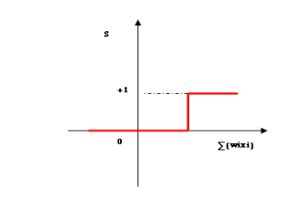
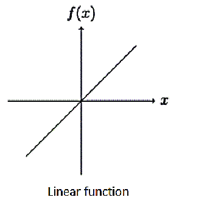
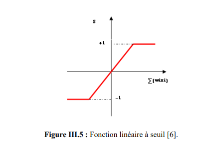
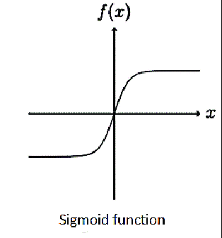

## Activation functions:

### step function

It was used by McCulloch and Pitts in their model of the formal neuron. It causes the neuron's activation to switch from one value to another as soon as the resulting input exceeds a certain threshold (Equation III.2). Thresholding introduces a non-linearity in the behavior of the neuron. However, it limits the range of its possible responses to two values (Figure III.3).  
The drawback of this function is that it is not differentiable, which poses a problem for gradient-based algorithms. The equation that defines the neuron's state is [6].

The step function was used by McCulloch and Pitts in their perceptron. It determines whether a neuron should activate or not based on whether the weighted sum of inputs exceeds a threshold.

The mathematical equation for the step function is given as:

$$
f(x) = 
\begin{cases}
1 & \text{if } \sum_{i=1}^{n} w_i x_i + b \geq \theta \\
0 & \text{otherwise}
\end{cases}
$$

**Equation** the step function equation

where:

- $x_{i}$ are the inputs of the neuron.

- $w_{i}$ are the weights corresponding to the inputs.

- $b$ is the bias.

- $θ$ is the activation threshold.

- $f(x)$ is the output of the neuron.

**Figure** the step function graph

### Identity Function

The **Identity activation function**, is a function that returns the input value unchanged. It is mathematically defined as:

$$
f(x) = x
$$

The output of the function is a direct linear function of the input. see **Figure**.

**Figure**: Identity Function *(Linear function)* graphical representation.

This function allows the MLP *(Multi layer perceptron)* to output any real value, which is suitable to model relationships where output are not restricted to a specific range. But it does not introduce non-linearity to the system, which makes MLP using it an equivalent to a linear model.

### Linear Threshold Function

This function is a compromise between the linear function and the threshold function, By changing the slope of the linear region, we can adjust how strongly the neuron responds.

**Figure** Linear Threshold function

### Sigmoid function

The **sigmoid function** is a smooth, nonlinear activation function, It maps real-valued inputs to a bounded range between 0 and 1. see **Figure**

$$
f(x) = \frac{1}{1+e^{-x}}
$$

This function introduces non-linearity and it allows the network to model complex, nonlinear patterns.

**Figure**: graphical representation of the Sigmoid function

### Hyperbolic Tangent *(Tanh Function)*

The **Hyperbolic Tangent** *(tanh)* transforms input values into a smooth, S-shaped curve see **Figure**. This function helps introduce none-linearity into the model.

The functions is defined mathematically as:

$$
f(x) = \frac{e^{x}-e^{-x}}{e^{x}+e^{-x}}
$$

with $-1<f(x)<1$.

**Equation** of the Hyperbolic Tangent function *(tanh)*.

**Figure**  A graphical representation of the Hyperbolic Tangent function *(tanh)*.

### Radial Basis Function *(RBF)*

The *RBF* activation function transforms the weighted sum of inputs into a value between 0 and 1 (or a similar range). The most common type of **RBF** is the Gaussian function, which has a Bell-shaped curve, see **Figure**. The output of the function depends on the distance between the input and a central point, the closer the input is to the center, the higher the output.

The *RBF* equation is given as:

$$
f(x) = e^{-\frac{|x-c|^2}{r^2}}
$$

**Equation** The Radial Basis Function

Where $c$ is the center and $r$ is the radius.

**Figure** Gaussian Radial Basis Function graph

