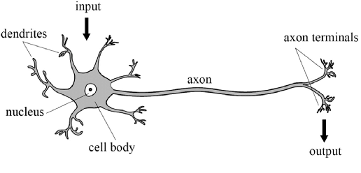
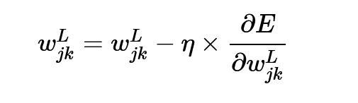
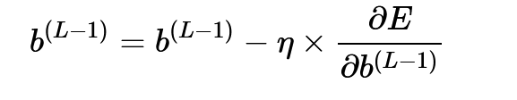

# Machine learninig approaches(techniques)

# Introduction

Observations from the study of biological systems served as the inspiration for the mathematical creation of artificial neural networks which offer a new approach to problems of perception, learning, memory, and reasoning. They infer emergent properties that allow us to solve problems that were considered complex before and prove to be very promising alternatives for circumventing some of the limitations of conventional computers [1]. 

The brain learning process consists of either establishing new connections or modifying existing ones. Based on this concept, we build artificial models of neurons and train them to eventually perform useful functions, even if the networks we develop possess only a tiny fraction of the power of the human brain. Artificial neural networks are not any more similar to real neurons than feathers are to modern airplanes, despite being modeled after the connections between neurons present in biological systems. Although both biological systems—feathers and neurons—have practical uses, the application of the underlying principles has led to the development of artificial inventions that are very different from the biological systems [2].

Neural networks find applications in various fields. Among them, airplane autopilot, car guidance, signal processing systems, speech synthesis and speaker recognition, computer vision and face recognition, forecasting the monetary markets, assessing financial or insurance risk, medical diagnosis, oil and gas exploration, robotics, telecommunications, etc. 

There are different types of neural networks, each performing a specific function, among them, regression and classification. The most commonly used type of Neural Networks is the multi-layer perceptron.

In this section, we will introduce neurons and their properties, layered neural networks as well as learning algorithms.

# Neuron Model:

## Biological neuron:

The biological neuron is composed of a cell **body** containing the nucleus, an **axon** that transmit information via its synaptic terminals and **dendrites** that receive inputs from other neurons via synapses.[^3]

`**Figure 2.1**: biological neuron`

## Artificial neuron:

The artificial neuron is inspired by the biological neuron model; it consists of an integrator that performs the weighted sum of its inputs. The result of this sum is then transformed by a transfer function, which produces the output of the neuron; a model of a neuron is presented in **Figure 2.2***. [^4]

`**Figure 2.2** artificial neuron model`

[^4]:  dfasf,`R ´ESEAUX DE NEURONES
GIF-21140 et GIF-64326
par Marc Parizeau
Automne 2004`

$z$ : is the weighted sum of the input values plus the biases, the output of the neuron will $a$

$$
z = \sum_{i=1}^{n} w_{i,j} x_{i} + b

$$

**Equation N01**

$$
a = f(z)
$$

**Equation N02**

The neural network can be represented in matrix form as 

$$
a = f(\sum_{i=1}^{n} w_{i,j}x_{i} + b)
$$

such that $w$ is the $(n, 1)$ matrix of weights of the neuron connections  

`**Figure 2.3**: matrix representation of an artificial neuron model`

## Activation functions:

There exists various types of activation functions, among them, threshhold function, liniar function, sigmoid funciton and hyperbolic function.

### Radial Basis Function Networks (RBFs)

These use the same architecture as MLP, but the activation functions are Gaussian
functions.

The usual activation functions of a neuron are summerised in the table below:

`**Table 2.1**: usual activation functions`

## Layerd neural networks(Mulitlayer perceptron):

`Neural networks  are structured in layers *(input layer, hidden layers, output layer)*, each layer is composed by a number of neurons.`

## Multi-Layer Perceptron (MLP)

The Multi-Layer Perceptron (MLP) is likely the most well-known type of neural
network. Its structure includes an input layer, an output layer, and one or more
hidden layers. Each neuron connects only to the neurons in adjacent layers.
MLP is an enhanced version of the single-layer perceptron, adding hidden layers.
They use the backpropagation algorithm to update weights. The goal is to
minimize the mean squared error, typically using a differentiable function like the
sigmoid. The error is propagated from the output layer back to the input layer.
**Input layer**: receives source data for analysis. The number of input nodes equals
the number of input variables (one input node per variable).
**Hidden layers**: are intermediate layers between the input and output layers, with
typically nonlinear activation functions. The number of hidden nodes must be
chosen carefully.
**Output layer**: returns the processed result. The number of output nodes depends
on the task type. For instance, in a regression problem, we use a single output
node. However, in a classification problem, the number of nodes is usually equal to
the number of classes.

The structure in **Figure 2.4** presents a multilayer preceptron *(neural network)* scheme with input layer, one hidden layer, and an output layer.

`**Figure 2.4**:  neural network structure with one hidden layer`

The weight matrix of a such network is given as:

$$
W =\begin{bmatrix} w_{1,1} & w_{1,2} & ... & w_{1, n}\\
w_{2,1} & w_{2,2}  & ... & w_{2, n} \\
... & ... & ... & ... & \\
w_{m,1} & w_{m,2}  & ... & w_{m, n} \\
\end{bmatrix}

$$

Each row of the matrix represents the number of an input to the network, and each column represents the number of neurons in the hidden layer.

In the case of a connection between two layers of a multilayer network, the rows represent the outputs of the previous layer and the columns represent the inputs of the next layer.

## Learning process:

Learning in neural networks involves estimating the parameters (weights) of a network in response to its environment excitation. The learning type is determined by the way in which the parameter updates. Three learning types exist: supervised, unsupervised, and semi-supervised.

In our work we are intersted in supervised learning method.

`The learning process is based on minimization of the error between the output calculated by the neural network and the actual output. The connection weights between the different neurons will be adjusted after computing the error.`

## Supervised learning process:

Supervised learning process is based on minimization of the error between the desired output *(actual output)*  and the outputs computed by the neural network in order to adjust the network's weights.

`**Figure 2.5**: Supervised learning diagram.`

## Cost function:

The primary objective of neural network training is to minimize the least squares cost function see **Equation N03**, where $\hat{y}$ is the predicted value, and $y$ is the expected value. 

$$
E = \frac{1}{2}(\hat{y}-y)^2
$$

**Equation N03**: The sum of squared errors formula.

Since, neural networks are nonlinear systems, the process of finding optimal parameters by setting the gradient of the cost function to zero also becomes nonlinear, which make the parameter estimation process more complex.

Another problem is existence of local minima in the cost function, since it's not quadratic, it does not have only one minimum, this is shown in **Figure 2.6**.

`**Figure 2.6**: A representation of the cost function with local minima and a global minima of an artificial neuron with two inputs.`

Iterative methods are used to minimize the cost function of a nonlinear model, where the model parameters are adjusted based on the gradient of the cost function.

On each iteration *(epoch)* of the learning process, two distinct components are needed:

- Evaluation of the gradient of the chosen cost function.

- Adjusting the parameters of the neural network based on this gradient to approach a minimum of the cost function.

## Backpropagation algorithm

The backpropagation learning alogrithm is an itirative algorithm with the aim to find the optimal weights in the terms of minimizing the cost function on the learning set. This minimization of the cost function using the gradiant of the cost function with respect to weights.

A key part in the learning procedure of neural networks is an algorithm called **Back propagation**.

**Figure** backpropagation learning alogrithm

We use the letter $j$ to index the units in the output layer, the letter $k$ to index the units in the hidden layer, and the letter $i$ to index the units in the input layer. We also need indices for the 
weights. For any network with multiple units, we will have more weights than units, which means we will need two subscripts to indicate each weight.We will index the weights as $w_{destination-units, origin-units}$ .For instance, weights in $(L)$ become $w_{jk}$.

The derivative of the error w.r.t the weights in (L) layer is given by:

assuming a network with multiple output units. The error derivatives with respect to $w$ in $(L−1)$ is given by:

Considering the new indices, the derivative for the error with respect to the bias b is given by:

The error derivatives with respect to $b$ in (L−1) is given by:

## Backpropagation weight update

Now we use the computed gradients to update the weights and biases values. We do this by taking a portion of the gradient and substracting that to the current weight and bias value.

For the wegiths wjk in the (L) layer we update by:

For the wegiths wki in the (L−1) layer we update by:

For the bias b in the (L) layer we update by:

For the bias b in the (L−1) layer we update by:

Where $η$ is the *step size* or *learning rate*.

## 

## 

A key part in the learning procedure of neural networks is an algorithm called **Back propagation**.

Considering a none feedback neural network of a single input unit, a single hidden unit and a single output unit, a graphical representation is shown in **Figure 2.7**.

**Figure 2.7**: An artificial neural network with a single unit in the input, hidden, and output layers.

Applying the chain-rule of calculus on the cost function, see **Equation N03**, to calculate the error $E$ with respect to the weights $w$ in layer *(L)* will result in the following equation:

$$
\frac{dE}{dw^{L}} =
\frac{dE}{da^{L}} \times
\frac{da^{L}}{dz^{L}} \times
\frac{dz^{L}}{dw^{L}}
$$

**Equation N04**: Partial Derivative of the Error with Respect to Output Layer Weights

As for calculating the gradient of the error $E$ with respect to the weights $w$ in the hidden layer *(L−1)*,  see **Equation N05**.

$$
\frac{dE}{dw^{L-1}} =
\frac{dE}{da^{L}} \times
\frac{da^{L}}{dz^{L}} \times
\frac{dz^{L}}{da^{L-1}} \times
\frac{da^{L-1}}{dz^{L-1}} \times
\frac{dz^{L-1}}{dw^{L-1}}
$$

**Equation N05**: Partial Derivative of the Error with Respect to Hidden Layer Weights
