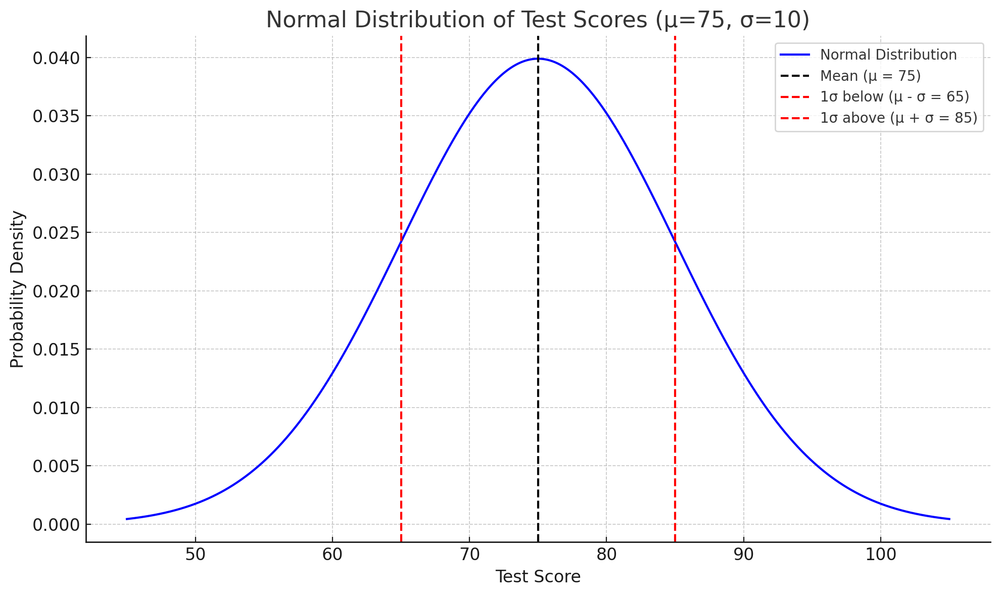
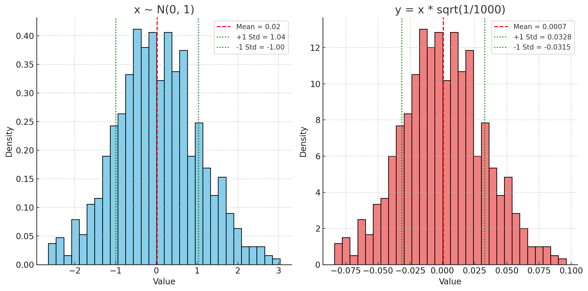

# Weight Initialization

## How are weights initialized, and what's the impact?

## Can we change how weight initialization occurs?

## How to specify weight initialization Keras ?

# # Other math

**Mean:**

$\bar{x} = \frac{1}{n}\sum_{i=1}^{n}x_{i}$

**Variance:**

$\sigma^2 = \frac{1}{n}\sum_{i=1}^{n}(x_{i}-\bar{x})^2$

**Standard deviation:**

$\sigma = \sqrt{\frac{1}{n}\sum_{i=1}^{n}(x_{i}-\bar{x})^2}$

### when not to

$\sqrt \frac{2}{n1+n2}$

why $\sigma$ is 1/3 of $\mu + 1/2$

