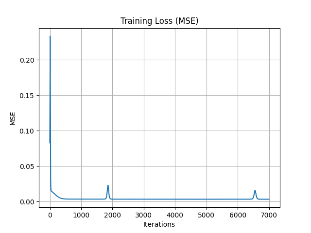

`https://medium.com/@piyushkashyap045/mastering-weight-initialization-in-neural-networks-a-beginners-guide-6066403140e9https://medium.com/@piyushkashyap045/mastering-weight-initialization-in-neural-networks-a-beginners-guide-6066403140e9`

## Weight Initialization

---

#### Practical Observation

The importance of proper weight initialization can be observed during training. In the following figure, we trained an MLP with **4 neurons in the hidden layer**, and although the overall mean squared error (MSE) decreased with training, **some spikes in error** appeared during specific iterations.

These error spikes are due to instabilities in the training process, which often stem from **inappropriate weight initialization**. This highlights the necessity of adopting effective initialization methods like Xavier or He initialization to ensure smoother and more reliable convergence.

---

In the provided training loss (MSE) graph, the behavior of the curve shows a **mostly smooth decrease** in loss over time, but with **two noticeable spikes** around iteration **~2000** and **~6800**.

### Here's what likely happened:

#### 1. **Overall Behavior – Converging Loss**

- The training loss starts relatively high and then decreases rapidly, indicating that the model is learning and the weights are being updated properly.

- After a few hundred iterations, the loss flattens out near zero, suggesting the model is approaching convergence and performing well.

#### 2. **Spikes Around Iterations ~2000 and ~6800**

These sudden increases in loss (error spikes) could be caused by one or more of the following:

---

### 📌 **Possible Causes of Error Spikes**

#### A. **Bad Weight Updates (Gradient Instability)**

- Even if initialization was good, a particular batch of training data may cause the gradients to be large, leading to a large weight update that destabilizes learning.

- This could happen due to **exploding gradients**, especially if your learning rate is a bit too high.

#### B. **Learning Rate Too High**

- A high learning rate can cause the model to overshoot the minimum of the loss function, temporarily increasing error before stabilizing again.

- This often produces the kind of sharp spikes seen here.

#### C. **Batch/Outlier Effects**

- If you're using mini-batch gradient descent, an **anomalous batch** with outlier samples could momentarily skew the error.

- After processing this batch, the loss drops back to normal, as the model readjusts on later batches.

#### D. **Numerical Instability**

- If your weights or gradients become too large or too small, **numerical errors** can creep in, especially in floating-point operations, leading to sudden instability.

---

### Final Thought (in context of your thesis):

These error spikes demonstrate **why proper weight initialization and a stable learning rate are critical**. Even a small issue in these settings can momentarily destabilize training and affect convergence. This supports your argument that Xavier and He initializations are valuable choices, especially when paired with careful hyperparameter tuning.

Would you like me to help you add this deeper explanation to your thesis text?

