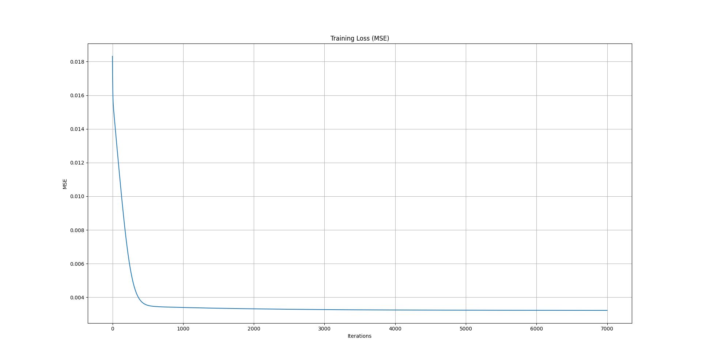
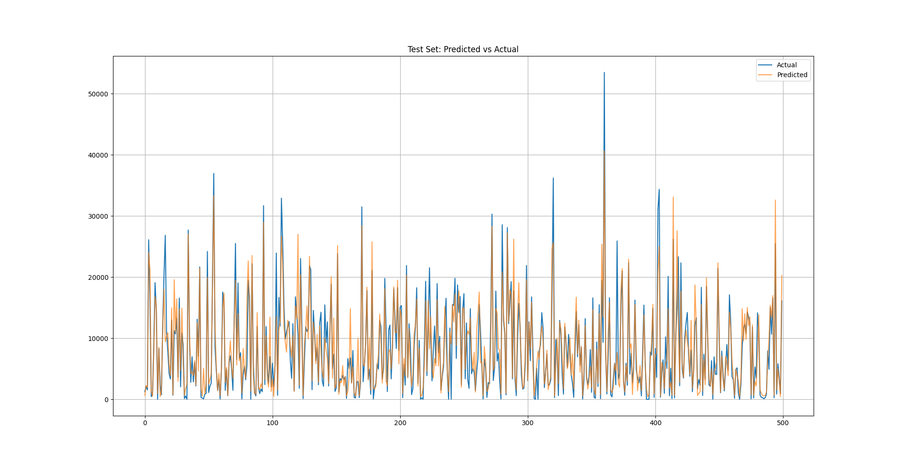
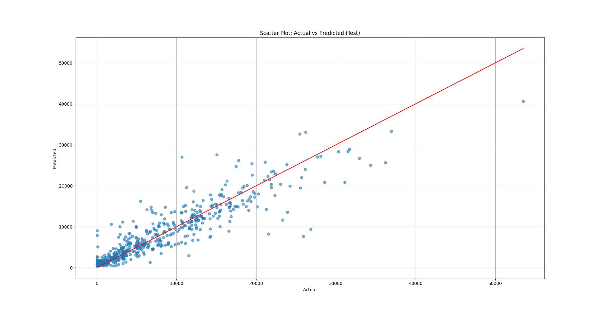
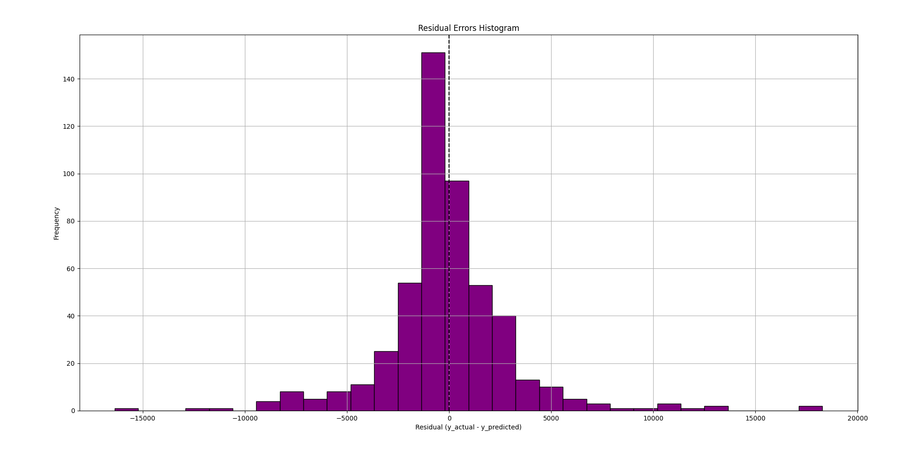
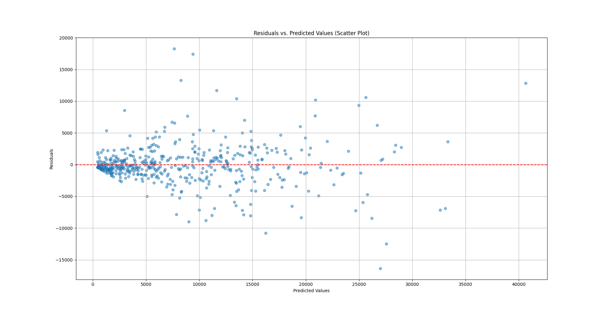
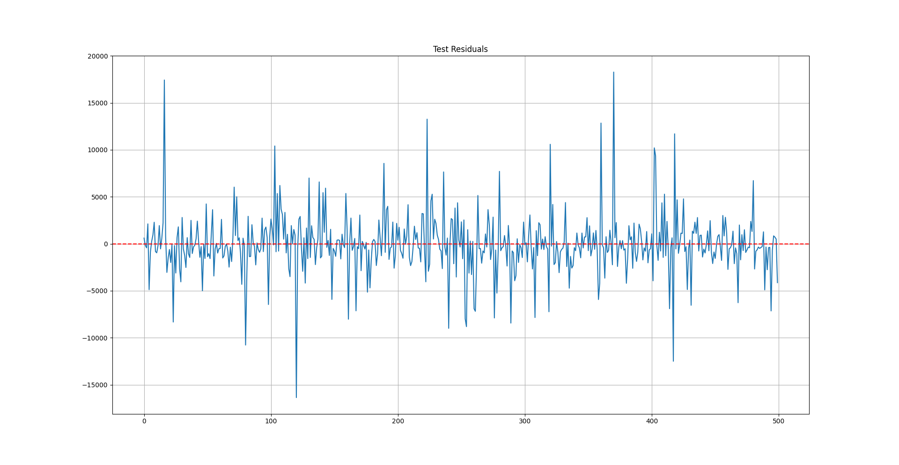
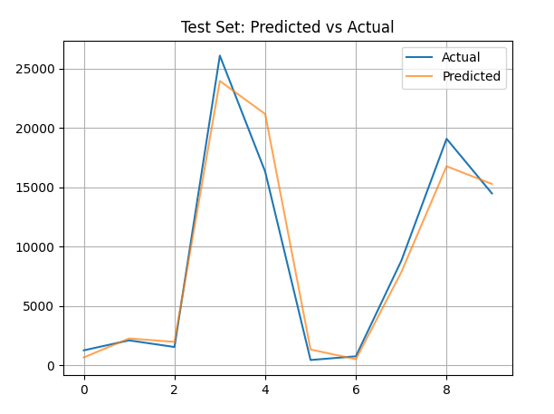

## <mark>Results and discussions</mark>

For evaluating the performance of Multilayer perceptron *(**MLP**)* model implemented in forecasting traffic throughput in the 4G mobile network, Several experiments were conducted with varying hidden neuron counts. The dataset used was split using a 90/10 train-test ratio. The **MLP** was trained using Xavier initialization, with a learning rate of 1 and 7000 iterations across all tests to ensure consistency.

### <mark>5.1 Performance comparison</mark>

The following table summarizes the performance *(measured using the $R^2$ metric)* of the **MLP** model wither different neurons in the hidden layer:

| Number of neurons in hidden layer | weight initialization method | Learning rate | number of iterations | $R^2$ metric | RMSE |
|:---------------------------------:|:----------------------------:|:-------------:|:--------------------:|:------------:|:----:|
| 3                                 | Xavier Normal                | 1             | 7000                 | 0.8198       |      |
| 4                                 | Xavier Normal                | 1             | 7000                 | 0.8202       |      |
| 10                                | Xavier Normal                | 1             | 7000                 | 0.8110       |      |

### <mark>5.2 Model selection</mark>

The model with 3 hidden neurons was selected for production deployment, this was due to the model low complexity, which translates to:

- Faster training time

- Lower computational cost

- Simpler architecture 

Although the configuration with 4 hidden neurons slightly outperformed the other configurations in terms of the $R^2$ score *(0.8202)*, the marginal difference in performance of less than *0.005* did not justify the added complexity of additional neurons.

### <mark>5.3 Selected Model performance</mark>

The primary metric used to evaluate the mode's predictive accuracy on the test set is the **Coefficient of determination *($R^2$)***. The MLP model achieved an accuracy of about **81.98%**. This level of accuracy suggests a good fit to the data and a considerable predictive capability for short-term traffic fluctuations.

### <mark>5.4 Training process analysis</mark>

The training process of the **MLP** model was monitored by observing the Mean Squared Error *(**MSE**)* over epochs, **Figure** illustrates the training loss curve.

`Training mean squared error (MSE) per epoch.`

As depicted in the **Figure**, the **MSE** shows a rapid decrease during the initial training epochs, then it levels in the rest, this behavior shows that the model has converged well without signs of instability, though the stabilization of the loss suggests that the model has reached a point where further training on the same data with the current configuration is unlikely to give any more improvements.

### <mark>5.5 Prediction accuracy on test data</mark>

To assess the model's forecasting capability. its predictions on the test set *(500 hours)* were compared against the actual recorded throughput values.

#### <mark>5.5.1 Actual vs predicted throughput over time</mark>

The **Figure** below provides a time series comparison of the actual throughput and the **MLP** model predictions on the test set.



`Actual vs predicted throughput on the test set.`

The plot shows that the predicted throughput *(orange line)* generally follows the trends and patterns of the actual throughput *(blue line)*. The model appears capable of capturing the general fluctuations of the mobile network traffic. However, it can observed that the model's underestimate the peaks *(high traffic periods)* and overestimate the dips *(low traffic periods)*. `opportunity for further model refinement/ common in regression tasks`

#### <mark>5.5.2 Scatter plot of actual vs predicted values</mark>

The **Figure** below presents a scatter plot of the predicted throughput values against the actual throughput values for the test set. The red line represents the ideal scenario where predicted values perfectly match the actual values.



`Scatter plot actual vs predicted throughput on the test set.`

The concentration of points around the diagonal line visually confirms the strong positive correlation between predicted and actual values, which is clearly supported by the $R^2$ score of 0.8198, the plot indicates that the model performs consistently across a range of throughput values. However, a slight tendency for the spread of points to  increase at higher throughput values can be observed.

```
error might be larger during periods of very high traffic
what can you read from scatter plots
heteroscedasticity
```

### <mark>5.6 Residual analysis</mark>

The analysis of the residuals *(the differences between actual and predicted values)* provides deeper insights into the model's behavior and it's shortcomings.

#### <mark>5.6.1 Residuals histogram</mark>

The **Figure** below displays a histogram of the residual errors from the test set.



`Histogram of residual errors on the test set.`

From the histogram it's clear that the residuals follow a normal distribution with mean of zero *(center)*. This is a desirable characteristic, indicating that the model accuracy is acceptable, and it also indicate that the model does not consistently make the same type of error, such as always overestimating or underestimating. Another observation is that the majority of prediction errors are relatively small, clustering around the mean, the spread of the distribution along with a few large values at the ends, shows how big the model's prediction errors can be.

#### <mark>5.6.2 Residuals vs. predicted values analysis</mark>

Plotting the residuals against the corresponding predicted values helps to determine if the model's prediction error is consistent across the range of predicted outputs. **Figure** presents this scatter plot for the test set.



`Scatter plot of residuals vs predicted values on the test set.`

As observed in **Figure** the residuals are centered around the zero line when the throughput value is less then 20000 Kbps, and at lower throughput values the residuals are tightly clustered around zero, which indicates that the model predictions are more accurate at low throughput values where congestion or network performance issues are present.


### 5.7 Discussion

The results indicates that the relatively simple MLP model utilizing only the throughput of the current and previous hour, provides a reasonably accurate forecast for the next hour in the 4G mobile network, achieving an $R^2$ of approximately 0.82. The sigmoid activation function in the hidden layer allowed the model to capture the non-linear relationships in the traffic data, while the linear activation function in the output unit is appropriate for the regression task of predicting the continuous throughput values.

---

#### 5.6.2 Test residuals plot

Presented below is a **Figure** that shows the residuals plotted against the predicted throughput values.



`Plot of residuals vs predicted values on the test set.`

This is a jagged meaningless line. The error for a prediction at a point is not sequentially relat4ed to the error for a prediction of another point. They are independent events. Connecting them with a line would imply a trend that doesn't exist.

---

---

before denormalization $RMSE = \sqrt{\frac{1}{2n}\sum_{i=1}^{n}(\hat{y_{i}}-y_{i})^2}$

```
hidden_neurons=4
Test R² Score: 0.8202

hidden_neurons=10
Test R² Score: 0.8110

hidden_neurons=3
Test R² Score: 0.8198
```

```

```


---

---

## heteroscedasticity


The cone-shaped scatterplot indicates that the model performs differently depending on the magnitude of the estimated value. In this case, the model performs better (the residuals are smaller) for tracts with fewer crimes than for tracts with many crimes.




| Issue                    | Suggestion                                                        |
| ------------------------ | ----------------------------------------------------------------- |
| Missing RMSE values      | Add RMSE to performance table                                     |
| High learning rate       | Justify or adjust                                                 |
| Feature selection        | Explain input choice                                              |
| Lack of cross-validation | Discuss or acknowledge                                            |
| Grammar/typos            | Proofread and correct                                             |
| Figure references        | Number and cite consistently                                      |
| Statistical significance | Add or acknowledge                                                |
| Residual analysis        | Link observations to model assumptions (e.g., heteroscedasticity) |
